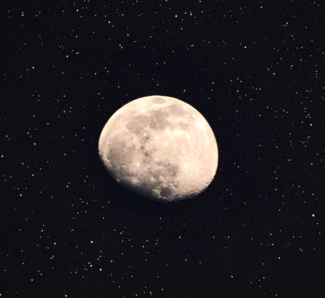

Sói luôn đi săn theo đàn. Nhìn rất là cool


> Golang code is beautiful

```go {linenos=table,hl_lines=[8,"15-17"],linenostart=1}
// GetTitleFunc returns a func that can be used to transform a string to
// title case.
//
// The supported styles are
//
// - "Go" (strings.Title)
// - "AP" (see https://www.apstylebook.com/)
// - "Chicago" (see https://www.chicagomanualofstyle.org/home.html)
//
// If an unknown or empty style is provided, AP style is what you get.
func GetTitleFunc(style string) func(s string) string {
  switch strings.ToLower(style) {
  case "go":
    return strings.Title
  case "chicago":
    return transform.NewTitleConverter(transform.ChicagoStyle)
  default:
    return transform.NewTitleConverter(transform.APStyle)
  }
}
```
